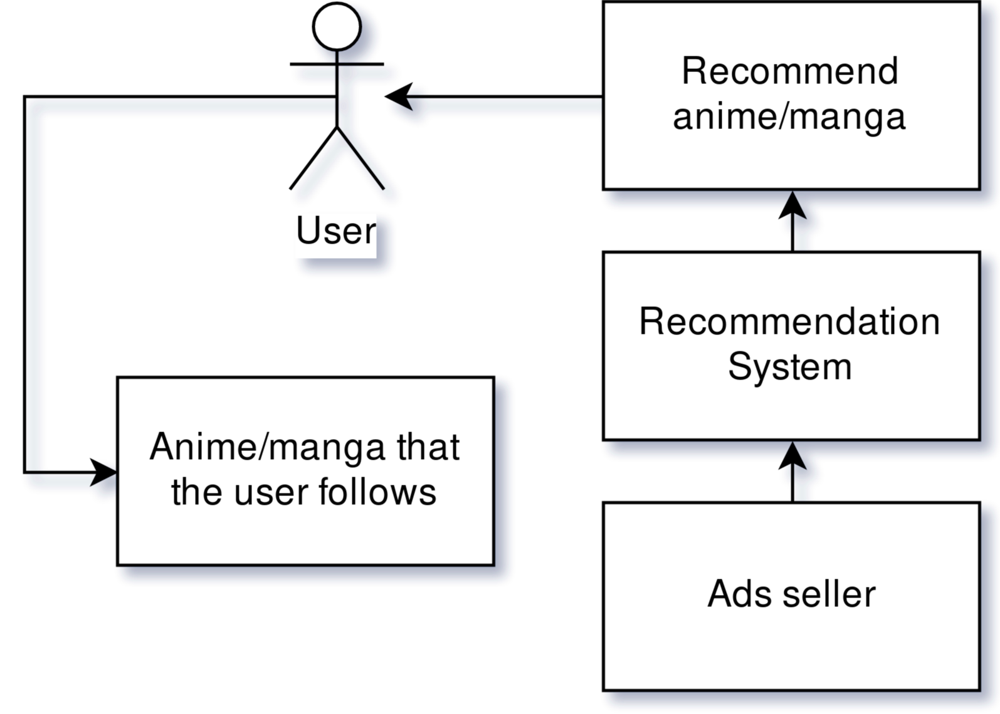
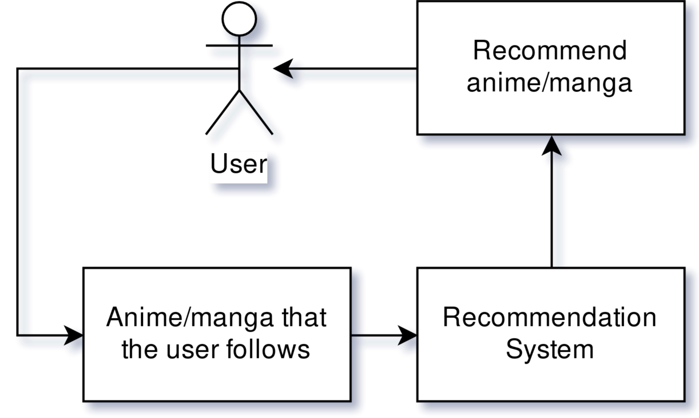

# Support

 

 
 

> A new code base to Anilist bot in Telegram.

## Reason
Like I've said, there's a reason why I choose to accept the donation form of supporting instead of showing/selling through ads:
> The reason is I want the recommendation system not to be biased.

Let me explain better...
# Bias
When using a system that you are not paying for and sells ads for you, the system itself is looking to show to you the ads of those whom paid more for it. In a nutshell, the system is working to support the system and those who want to show their ads in it.

     
    
	 
     

> "When you are not paying for it, you became the product."

## And what is the problem?
I want a system the works with the user interest in "mind", showing new recommendations that other users with similar tastes are listening to. This will only improve the system quality.

That way the system is working to improve the user experience.

# How is this possible?
Since I don't produce any anime/manga content, I don't have to sell to you anything. Like so, only the community trending anime/manga will be presented to you; this makes the user experience in a more natural way and whether or no a anime/manga is trending it will depend only in the capacity of those who made it.

     
    
	 
	 

## Why not a paid system?
If I choose a paid system this would be too much prohibited for some user that otherwise would enjoy the system. The donation/patron system works for a lot of podcasts that I listen to so, by their example, I would like to try it also.

# Supporting

Consider buy me a coffee:

Or even becoming a patron:

To all of my fellow countrymen, starting at one real each month:

