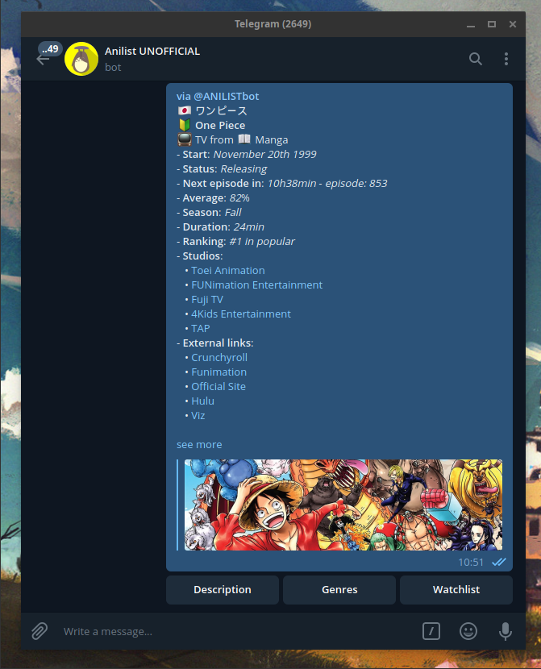

# AnilistBot


[](https://saythanks.io/to/Fazendaaa)

[](https://travis-ci.org/Fazendaaa/AnilistBot)
[](https://codecov.io/gh/Fazendaaa/AnilistBot)
[](https://www.codacy.com/project/Fazendaaa/AnilistBot/dashboard?utm_source=github.com&amp;utm_medium=referral&amp;utm_content=Fazendaaa/AnilistBot&amp;utm_campaign=Badge_Grade_Dashboard)
[](https://codeclimate.com/github/Fazendaaa/AnilistBot/master/package.json)
[](https://snyk.io/test/github/Fazendaaa/AnilistBot?targetFile=package.json)
[](https://codeclimate.com/github/Fazendaaa/AnilistBot/maintainability)

> A new code base to Anilist bot in Telegram.

## About
This bot helps you to send info in your [Telegram](https://telegram.org/) chats about:
* Animes
* Mangas
* Characters
* Studios
* Staffs
* etc

More than this it also notifies you when new episodes are released and lets you have a:
* Watchlist
* Readlist
* Countdown from new episodes
* Time watching anime calculator
* Anime and manga filters in your lists by: airing/publishing, completed, cancelled & soon
* News when released from [ANN](https://www.animenewsnetwork.com/) about your mangas and animes
* And much more features that are under development

All of the data about it is fetched from [Anilist](http://anilist.co/) & [Anichart](http://anichart.net/).

## Disclaimer
1. [JoshStar](https://github.com/joshstar) was kind to [allow](https://github.com/AniList/ApiV2-GraphQL-Docs/issues/50#event-1794658906) me to store the translated info about the content in different languages, improving the user experience;
2. This project is a new implementation, the old code base is [here](https://github.com/Fazendaaa/Anilist-bot);
3. Also, I've removed the _command_ option when talking to the to the bot from the old version due to low usage.

## Supported languages:
By default all the commands are in English, but you can see if the same command is available in your language. Only English and Portuguese had some kind of review, the others are automatic translation from [Google Translate](https://translate.google.com/).

* [Arabic](./others/locales/ar.yaml)
* [Chinese](./others/locales/zh.yaml)
* [Dutch](./others/locales/nl.yaml)
* [English](./others/locales/en.yaml)
* [French](./others/locales/fr.yaml)
* [German](./others/locales/de.yaml)
* [Indonesian](./others/locales/id.yaml)
* [Italian](./others/locales/it.yaml)
* [Japanese](./others/locales/jp.yaml)
* [Portuguese - Brazil](./others/locales/pt.yaml)
* [Russian](./others/locales/ru.yaml)
* [Spanish](./others/locales/es.yaml)

**Want a new language?** Talk to me through an issue about it or hit me up at Telegram: [@farmy](http://t.me/farmy).

# How to use it
First of all, talk to [@AnilistBot](http://t.me/anilistbot).

## Inline Searches
The inline searches works in any chat conversation:

```
@AnilistBot search content
```

Example:

```
@AnilistBot One Piece
```

<div align="center">
    
</div>



## Descriptions & Genres
Shows info about anime/manga.

<div align="center">
    
</div>

## Readlist & Watchlist
Add to your list to watch or read later.

<div align="center">
    
</div>

## Countdown
Shows a countdown of your next content releases.

<div align="center">
    
</div>

## Help
If you have any other questions about it just use it the help command in a bot chat talk:

```
/help
```

# Supporting

Right now, this project has the following total lines of code:


And this bot uses four paid services:
1. [Heroku](http://heroku.com/)
2. [Heroku Redis](https://elements.heroku.com/addons/heroku-redis)
3. [mLab](https://mlab.com/)
4. [Google Translate](https://translate.google.com/)

All of your support actually makes a difference to help me maintain this project up and running. I really would love if anyone who uses it could support it helping one time with any value that think it worth it or even supporting it each month with one dollar through my Patreon. And this would allow me to improve this project more and more, adding a ton of features that I've planned.

You don't think that money is the best option to help out? It's okay, I'm open to translations request and code also! Just take a look at [Contributing](#contributing).

Also, I explain better the _"Why"_ receive donations instead of selling ads at [SUPPORT.md](./docs/support/SUPPORT.md).

Consider buy me a coffee:

[](https://www.buymeacoffee.com/Fazenda)

Or even becoming a patron:

[](https://www.patreon.com/Fazenda/overview)

To all of my fellow countrymen, starting at one real each month:

[](https://www.padrim.com.br/AnilistBot)

# Contributing
Please, I'm not a native/fluent english speaker, so whether you see a variable name wrote the wrong way or even some comment where I've wrote something with the wrong "past perfect way of life" or something like that, please let me know it. Not always is just about the code, but rather making it more clear to other people to learn from it.

So, whether is code or not you can help me out making this code more accessible or even supporting trough a new language or fixing some mistranslated content. Just read the [CONTRIBUTING.md](./docs/contributing/CONTRIBUTING.md).

# TODO
Since I will be keeping this README up to date with any major change and I don't use any versioning system to log all the fixed bugs or previous projects updates, you can still have a taste of what comes next and what is being under analysis right in the [Projects](https://github.com/Fazendaaa/AnilistBot/projects/) tab. But I can give you a taste what I have in mind:

* Caching most requested requisitions
* Improve metric in time watching Anime:
    * Provide to user options to _"what to do"_ in real life what he likes. Like showing a YouTube drawing channel if the users likes [Bakuman](https://anilist.co/anime/7674/Bakuman/) as one example
* Add a pattern matching like _"Did you mean?"_ of Google. Probably I will use it [didyoumean](https://www.npmjs.com/package/didyoumean) package
* Anilist connection
* Anime/manga review
* Support to anime/manga news besides ANN -- to improve news accessibility
* Natural Language Processing -- You can really have a talk to this bot
* Anime and Manga recommendation -- Create a engine to it:
    * Create another server to store this processing -- Talking to the bot through an GraphQL API and probably using [Rust](http://rust-lang.org/) to processing this info and [GO](https://golang.org/) to handle the API
    * Probably uses a server that allows GPU usage
    * Improve this engine through image, video and audio processing
* Create a site displaying info about:
    * Trending animes/mangas
    * A graph showing anime/mangas distances between users likes
* The site must be a [PWA](https://en.wikipedia.org/wiki/Progressive_Web_Apps) to allow new users besides the Telegram user base

Since I will be keeping this README up to date with any major change and I don't use any versioning system to log all the fixed bugs or previous projects updates, you can still have a taste of what comes next and what is being under analysis right in the [Projects](https://github.com/Fazendaaa/AnilistBot/projects/) tab.

# How does it work?
You can build yourself a bot similar to this one, I've wrote a tutorial about it in my [Podesearch Bot](https://github.com/Fazendaaa/podsearch_bot) just follow the procedures listed in [BUILDING.md](https://github.com/Fazendaaa/podsearch_bot/blob/master/docs/building/BUILDING.md).

# Artwork
I've made all the artwork for it, [Studio Ghibli](https://www.studioghibli.com.au/) was my inspiration.


You can see more in the [img](./others/img) folder.

# Authors
* Only [me](https://github.com/Fazendaaa) for now.

# License
Like many Open-Source Software (OSS) the MIT license is used, more about it in [LICENSE](./LICENSE).
